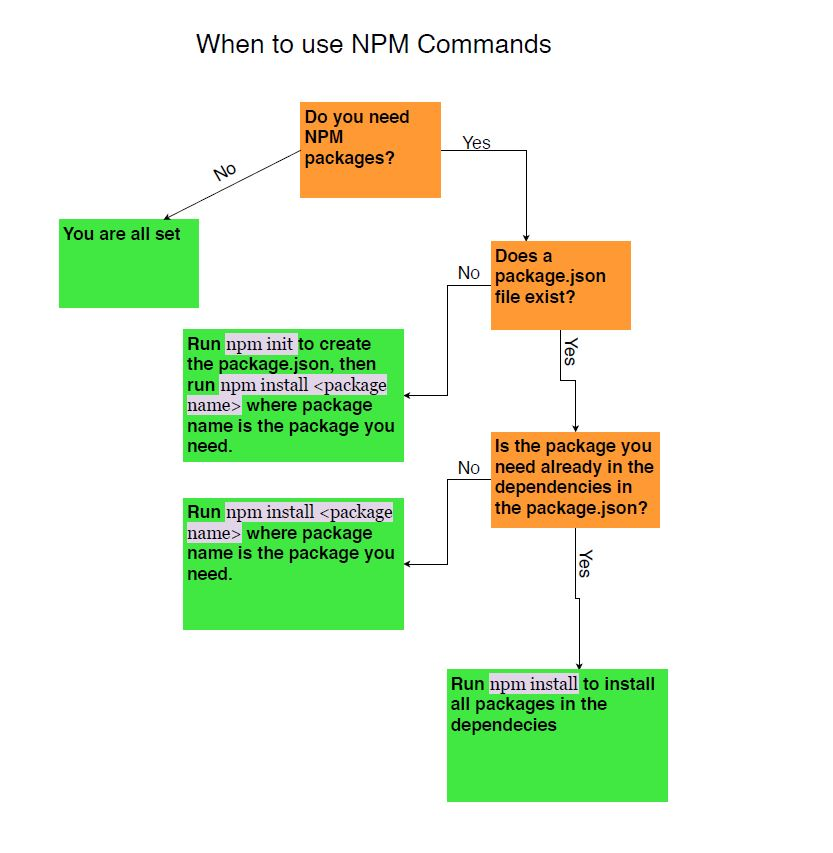

# ${response.title}

## Description 
${response.description}
    
## Table of Contents
* [Installation](#installation)
* [Usage](#usage)
* [Credits](#credits)
* [License](#license)

## Installation 
${response.installation}
 
  
## Usage 
${response.usage}
  

  
## Contributions
 

Language Contributions

  
${response.contribution}
To use the badges, feel free to check [shields.io](https://shields.io/) website for variety of badges
  
## Test Instruction  
${response.testinstruction}

## License 
This is the section where you will put the license that you have been using to create your HW, projects, or assignments
  
${response.license}